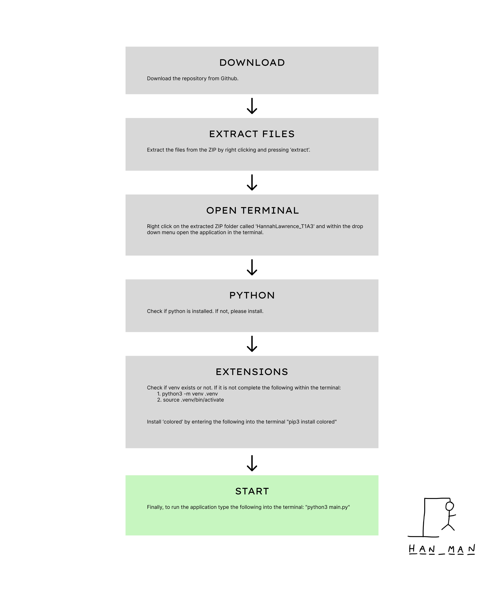
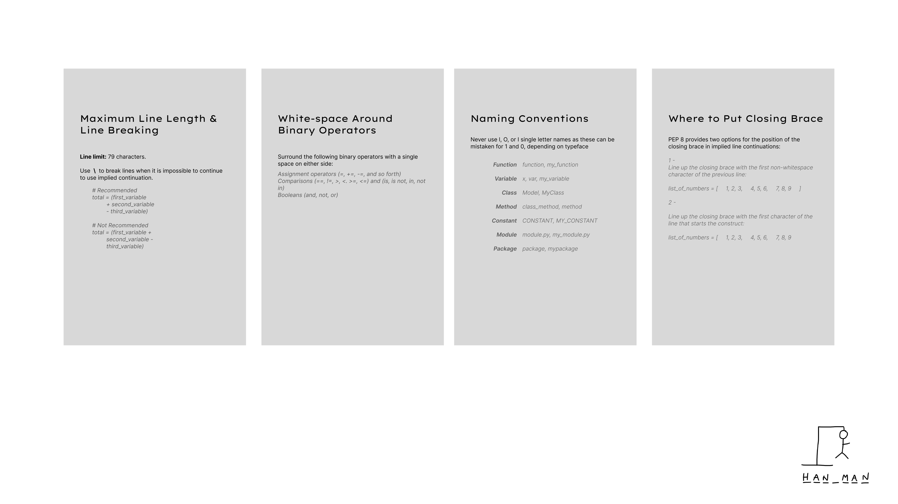
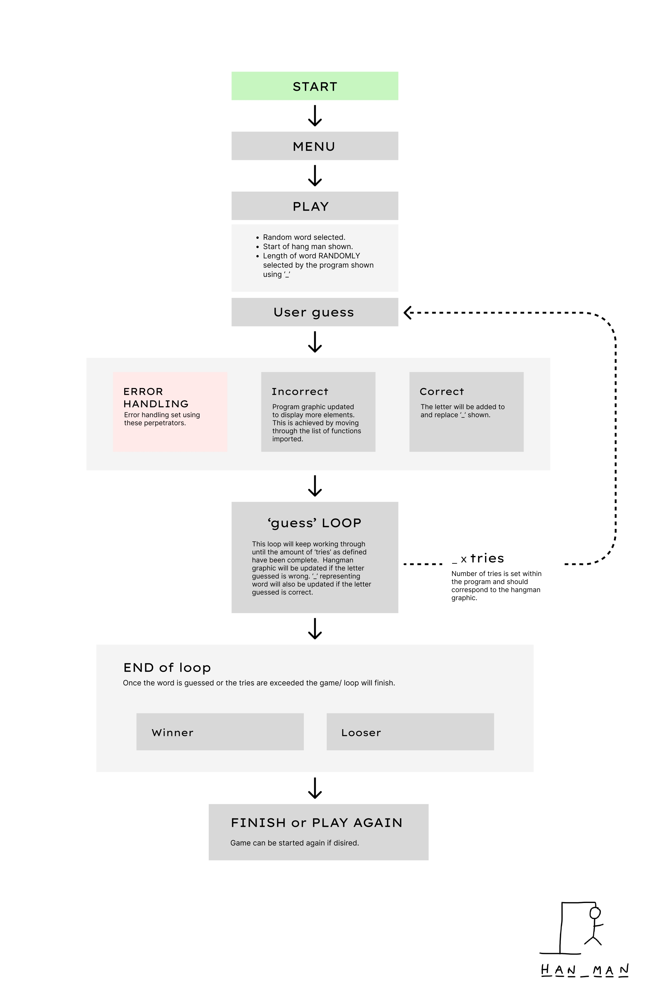
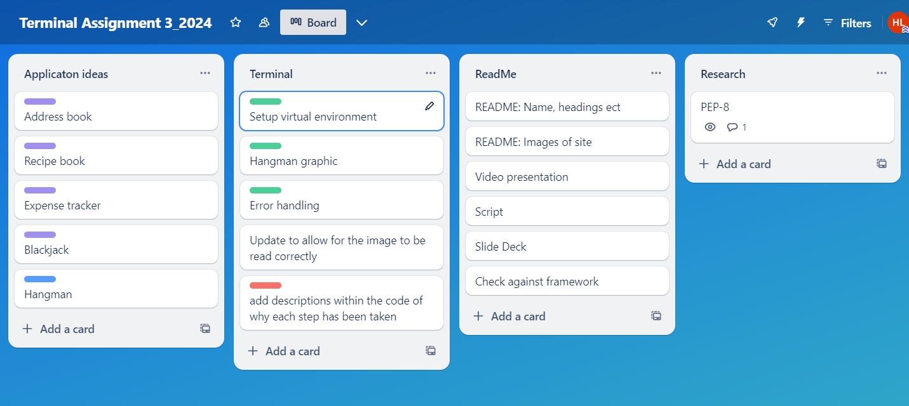

# HannahLawrence_T1A3

####  Terminal Game - HANGMAN 
## Introduction
#### Project description
This HANGMAN application is designed to demonstrate my ability to use a range of developer tools. This is accessable within a terminal environment. The program will bemonstrate concepts such as variables, loops, conditional control structures, and error handling.

*The HANGMAN game is accessible within a terminal environment.*

## Links
### Important links
[Github Repository](https://github.com/Hannah-codding/HannahLawrence_T1A3/tree/main)

#### Additional Links
- [Pinterest Board](https://www.pinterest.com.au/hannahl4579/terminal-site-ideas/)

- [Task Management](https://trello.com/invite/b/xU1mfQML/ATTIaa72f546d5e8ca253c162723a2d94776AB7FC2F1/terminal-assignment-32024)

 

## The User Experience
The user or player is prompted to play the game once they have accessed the application.The users will be promted to entre/ input single letters and a output will be produced that corrisponds to the guess correctness. 

####  ART 
Some ASCII art has been installed from online sources for further intrest. This includes the 'Game over' message at the end of the script after the loop is broken. 

####  COLOUR & BOLD 
Colour is set through out the game to emphasis diffrent elements and create visual intrest. Using the 'colored' extention this element is achieved. Please refer to the script below for further details. 

>  from colored import Fore, Back, Style
> 
>  print(f"{Fore.white}{Back.blue}          Wrong guess! Keep going!             {Style.reset}")
    

I also implemented some bolding within some areas of the code 

####  VISUAL  
These visual elements are set to make the game appear more engaging. The elements are run through based on the amount of 'tries' that are wrong, within the loop. The visual elements are run through in order in which they are written within the main.py doc. These visual elements were created using the same logic as 'cowsway'. Cowsway uses  =r''' to allow for multipule lines of code to not affect the script. 

hang_stages = [hang_pre, hang_start, hang_a, hang_b, hang_c, hang_d, hang_f, hang_end]

hang_X = r'''

          ____  
         I    I  
         I   _O_
         I    0
         I   ⅃ L  
        _I_________  
'''
    

## Application Features

#### WORD SELECTION
The game runs through a list of words found within 'Wordlist.py'. This was created using the following: 
 

> from Wordlist import word_list  # Secret word list
> def choose_word():  
>    return random.choice(word_list).upper()  
    

#### LETTER GUESSING
The player guesses letters one at a time, and the application provides feedback on the correctness of each guess.
If the guess is correct the hangman graphic will be updated, it will not be counted as a 'try' and the '_' will be updated to reflect the correct letter. 
The hangman graphics were achieved by aligning them to the amount of 'tries'. This is apart of the loop. 

### GAME OUTCOME
The game concludes with a winner graphic or loss graphic dependent on if the user guessed correctly, this final try or correct guess will end the loop. 

There is potential for the game to be played again/ the loop repeated by typing 'y' or 'yes'. 

        print(f"{Fore.white}{Back.yellow}        \033[1mType ANYTHING OTHER THAN YES to EXIT game.      \033[0m {Style.reset}") 
        print(f"{Fore.white}{Back.green}        \033[1mType 'YES' or 'Y' to keep playing game.         \033[0m {Style.reset}") 
        play_again = input("DO YOU WANT TO PLAY AGAIN?: ").lower()  
        if play_again != "yes" and play_again != "y":  
            print(gameover_message)  
            print(f"{Fore.white}{Back.red}    Thank you for using the Hangman application.    {Style.reset}") #final message at the end 
            break 
    

#### ERROR HANDELING
If the player guesses a row of letters or numbers an error message wil appear. This was created using the below: 

            if not guess.isalpha() or len(guess) != 1:  
                if guess == "EXIT":  
                    print("Exiting game.")  
                    print(f"{Fore.white}{Back.red}    Thank you for using the Hangman application.    {Style.reset}")  
                    return  
                print(f"{Fore.white}{Back.blue}    ERROR! Please enter a single letter.  {Style.reset}")  
    

#### EXIT GAME 
Players that wish to end the loop early can type 'exit' to leave the game and the loop will end early. 

>                if guess == "EXIT":  
>                    print("Exiting game.")  
>                    print(f"{Fore.white}{Back.red}    Thank you for using the Hangman application.    {Style.reset}")  
>                    return  
    

### APPLCATION LOGIC

### Steps to install the application

Please download VScode or a similar application and Python before opening the application.
1. Download the repository from GitHub
2. Extract files from the ZIP
3. Right click on the extracted ZIP folder called 'HannahLawrence_T1A3' and within the drop down menu open the application in the terminal. 
4. Check if python is installed. Please install it if it is not.
5. Check if venv exists or not. If it is not complete the following within the terminal:
      5. 1. python3 -m venv .venv
      5. 2. source .venv/bin/activate
6. Install ‘colored’ by entering the following into the terminal "pip3 install colored"
7. Finally, to run the application type the following into the terminal: "python3 main.py"

### Style Conventions used

Pep8 was chosen as it allows for clean and clear code. This will ensure that the file runs correctly and is easy to read.
Please refer to the image above to see some of the standard conventions for PEP-8.

## Sitemap

The sitemap illustrates the navigation flow of the application, including the home screen, loop for letter guessing, and finish screen with game outcome.

#### Home
- Game intoduction
- Promt for the first letter to be entred
- Hang Man base graphic displayed 

#### Loop
- The file will keep running until the user has either guessed the word or the hangman is complete.
- The errors incurred within this need to be handeled- this inludes multipule letters and numbers. 
- The user is to entre a single letter to get feedback
        - hangman graphic/ tires updated if the user types an incorrect guess
        - no graphic update/ try update if the user guess was correct. '_' is to be updated.

#### Game Finish 
- The game will either show if you have won or lost.
- The user wil be promted to restart the loop or not. They can type 'y' or 'yes' if they wish. 

#### Finish
- If the loop is not restarted or the user types 'exit' early then the game will come to an end. 
- The game over graphic will be displayed. 

## Implementation plan 
- [Task Management](https://trello.com/invite/b/xU1mfQML/ATTIaa72f546d5e8ca253c162723a2d94776AB7FC2F1/terminal-assignment-32024)

- Set up (first week- 1-2hrs)
   1. Setting up the virtual enviroment. 
   2. Push virtual enviroment to git hub. 
   3. Set _pycache_ and .venv 
   4. Create funtions (hangman graphic, artwork) and import this into main.py
   5. Research and import functions. (colored, random, os.path )
- Key features 
   1. Word slection was created using the following steps:
        - Create function to choose a word = 'random.choice'
        - Test the function
        - Verify that the word is displayed in uppercase = '.upper()'
        - Test
   2. Letter guessing:
        - Implement a loop to handle multiple guesses or 'tries'. 
        - Set the amout of tries to corrispond to the amount of hangman graphics to be created - a few errors occured due to this not aligning
        - Verify that the application correctly checks if the guessed letter is in the word.
        - Test the application to ensure it handles repeated guesses without penalizing the player.
   3. Graphic/ sytling 
        - Add styling to key elements 
        - Test 
        - Amend if any issues occur (into needed to be moved to another folder as this did not work)
        - Test
   4. Option to restart game loop again
        - use online tutorials and lectures to set how the game will restart 
        - set trigger words to be 'y' and 'yes' 
        - test 
        - fix and test again 
- README (last week- 1-2hrs)
   1. Graphic explanation created using Figma
   2. Write explanation for key functions.  
   3. Check work 
- Publish 

Program was published to github while it was being worked on. 

# Bibliography
- ASCII ART: https://www.asciiart.eu/computers/computers
- Terminal Styling: https://www.quora.com/How-can-you-make-text-bold-in-Python-What-is-the-difference-between-bold-text-and-regular-text-in-Python#:~:text=%C2%B7%201y-,How%20do%20you%20write%20bold%20in%20Python%3F,'%2F033%5B1m'.

