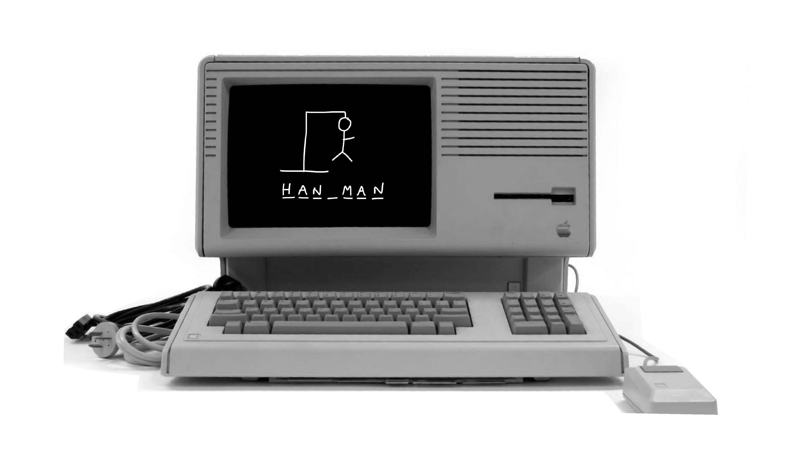
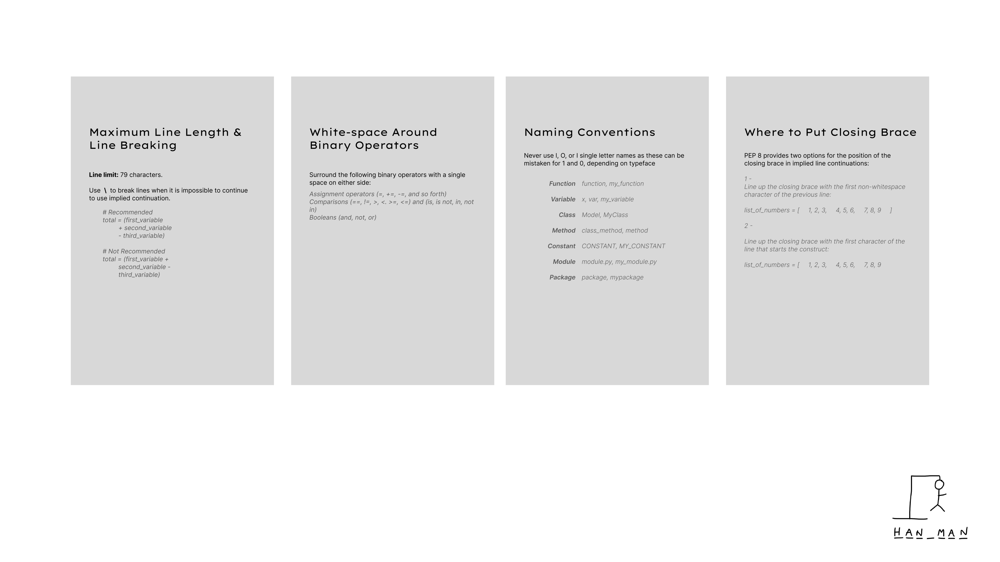

# HannahLawrence_T1A3
Terminal Assignment
                         





pep8 - used as the style guide for this app

## Project discription
*You are to design, implement and test a terminal application and throughout the process demonstrate that you are able to use a range of developer tools. The mandatory requirements/constraints for your application are:* 
    - *acept user input in the form of a file or text input* 
    - *produce printed output or interact with the file system*


## Contents 

1. [Introduction](#introduction)
2. [The User Experience](#the-user-experience)
    1. [User Goals](#user-goals)
    2. [Project Goals](#project-goals)
3. [Design and Flow](#design-and-flow)
    1. [Flow Chart](#flow-chart)
    2. [Flow Chart with Function Names and Variables](#flow-chart-with-function-names-and-variables)
    3. [Titles and Headings](#titles-and-headings)
4. Important links
    1. Sourse control repository
    2. Video Presentation
    3. Github Repository

<br>
<br>
<br>
<br>
<br>
<br>
<br>
<br>
[Back to top 🔺](# )

Examples 
```
--employee-id     <employee id>
--first-name      <first name>
--last-name       <last name>
--phone-number    <phone number>
--job-title       <job title>
--max-salary      <max salary>
--min-salary      <min salary>
--max-start-date  <max start date>
--min-start-date  <min start date>
```


# Important links
[Sourse control repository](https://???)

[Video Presentation](https://???)

[Github Repository](https://???)
<br>


# Introduction
cs


#### Additional Links 
- [Presentation Slide Deck](---)

- [Pintrest Board](---)

- [Task Management](https://trello.com/invite/b/xU1mfQML/ATTIaa72f546d5e8ca253c162723a2d94776AB7FC2F1/terminal-assignment-32024)


*Sytle Guide*
Google python style guide


# Applicaton ideas
Address book
Recipe book
Expense tracker
Blackjack
Hangman


# Bibliography (r3)
 Provide full attribution to referenced sources (where applicable).


#### Additional Links 
- [Presentation Slide Deck](./docs/PortfolioWebsite.pptx)

- [Pintrest Board](https://pin.it/6fFBCMTg1)

<br>
<br>

## Sitemap


### Sitemap Detailed Explanation 

#### Home
- Accessible via the logo and 'home' nav.
- The primary intention is to engage visitors and encourage exploration of the site.

#### About Me
- Includes a brief biography and description of skills.
- Placed at the start of the nav bar for hierarchical representation.

#### Portfolio
- Features projects as assets on the page.
- Each project is showcased with a brief description.

#### Blog
- Subpages for various blog posts.
- Accessible via the 'blog' subpage, ensuring ease of navigation.

#### Contact Me
- Provides external links to GitHub, LinkedIn, and Instagram.
- Allows visitors to reach out for further contact.


## Wireframes

- Mobile View: [MobileWireframes](./assets/mobilewireframes/moblie.pdf)


- Desk Top: [DesktopWireframes](./assets/desktopwireframes/desktop.pdf)


R5

Identify any code style guide or styling conventions that the application will adhere to.

Reference the chosen style guide appropriately.

R6

Develop a list of features that will be included in the application. It must include:

- at least THREE features

- describe each feature


Note: Ensure that your features above allow you to demonstrate your understanding of the following language elements and concepts:

- use of variables and the concept of variable scope

- loops and conditional control structures

- error handling


Consult with your educator to check your features are sufficient .

R7

Develop an implementation plan which:
- outlines how each feature will be implemented and a checklist of tasks for each feature
- prioritise the implementation of different features, or checklist items within a feature
- provide a deadline, duration or other time indicator for each feature or checklist/checklist-item

Utilise a suitable project management platform to track this implementation plan.

Provide screenshots/images and/or a reference to an accessible project management platform used to track this implementation plan. 


> Your checklists for each feature should have at least 5 items.

R8

Design help documentation which includes a set of instructions which accurately describe how to use and install the application.

You must include:
- steps to install the application
- any dependencies required by the application to operate
- any system/hardware requirements
- how to use any command line arguments made for the application


