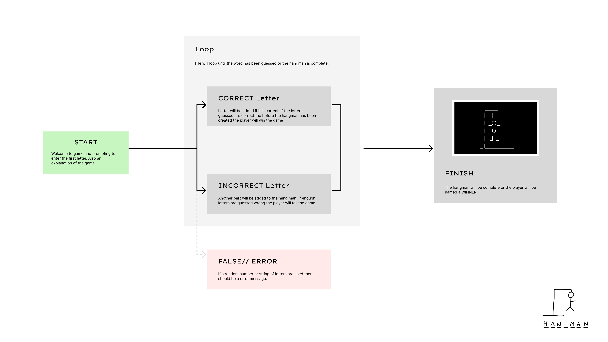

# HannahLawrence_T1A3 
####  Terminal Game - HANGMAN

## Project discription
*Design, implement and test a terminal application and throughout the process demonstrate that you are able to use a range of developer tools. The mandatory requirements/constraints for your application are:* 
    - *acept user input in the form of a file or text input* 
    - *produce printed output or interact with the file system*

The HANGMAN game will be accessable within a terminal enviroment. This program uses Python. 

		  ____   
		 I    I  
		 I   _O_ 
		 I    0
		 I   ⅃ L   
		_I_________    
		

# Important links
[Sourse control repository](https://???)

[Video Presentation](https://???)

[Github Repository](https://github.com/Hannah-codding/HannahLawrence_T1A3/tree/main)

 

#### Additional Links 
- [Presentation Slide Deck](---)

- [Pintrest Board](https://www.pinterest.com.au/hannahl4579/terminal-site-ideas/)

- [Task Management](https://trello.com/invite/b/xU1mfQML/ATTIaa72f546d5e8ca253c162723a2d94776AB7FC2F1/terminal-assignment-32024)

## Contents 

1. [Introduction](#introduction)
2. [The User Experience](#the-user-experience)
    1. [User Goals](#user-goals)
    2. [Project Goals](#project-goals)
3. [Design and Flow](#design-and-flow)
    1. [Flow Chart](#flow-chart)
    2. [Flow Chart with Function Names and Variables](#flow-chart-with-function-names-and-variables)
    3. [Titles and Headings](#titles-and-headings)
4. Important links
    1. Sourse control repository
    2. Video Presentation
    3. Github Repository

 
 
 
 
 
 
 
 

## Steps to install the application 
Please download VScode or a simlar application and Python before opening the application.
1. download the repository from GitHub 
2. Extract files from the ZIP
3. Right click on folder called 'HannahLawrence_T1A3' 
4. Within the drop down menu open the application in VS code
5. Open terminal within VScode
6. Run game by typing the following within the VScode terminal: 

## Style Conventions used

Pep8 was chosen as it allows for clean and clear code. This will ensure that the file runs correctly and is easy to read. 
Please refer to the image above to see some of the standard conventions for PEP-8. 

## Sitemap

### Sitemap Detailed Explanation 

#### Home
- Game intoduction (title ect)
- Promt for the first letter to be entred

#### Loop
- The file will keep running until the user has either guessed the word or the hangman is complete. 

#### Finish
- The game will either show if you have won or lost. 

*follow steps to run file again*

R6

Develop a list of features that will be included in the application. It must include:

- at least THREE features

- describe each feature

*Sytle Guide*
Google python style guide

## Implementation plan which:
- outlines how each feature will be implemented and a checklist of tasks for each feature
- prioritise the implementation of different features, or checklist items within a feature
- provide a deadline, duration or other time indicator for each feature or checklist/checklist-item

Utilise a suitable project management platform to track this implementation plan.

Provide screenshots/images and/or a reference to an accessible project management platform used to track this implementation plan. 

> Your checklists for each feature should have at least 5 items.

# Bibliography (r3)
 Provide full attribution to referenced sources (where applicable).

 
 

Note: Ensure that your features above allow you to demonstrate your understanding of the following language elements and concepts:

- use of variables and the concept of variable scope

- loops and conditional control structures

- error handling

Consult with your educator to check your features are sufficient .

R8

Design help documentation which includes a set of instructions which accurately describe how to use and install the application.

You must include:
- steps to install the application
- any dependencies required by the application to operate
- any system/hardware requirements
- how to use any command line arguments made for the application

[Back to top 🔺](## Terminal Game - HangMan)

